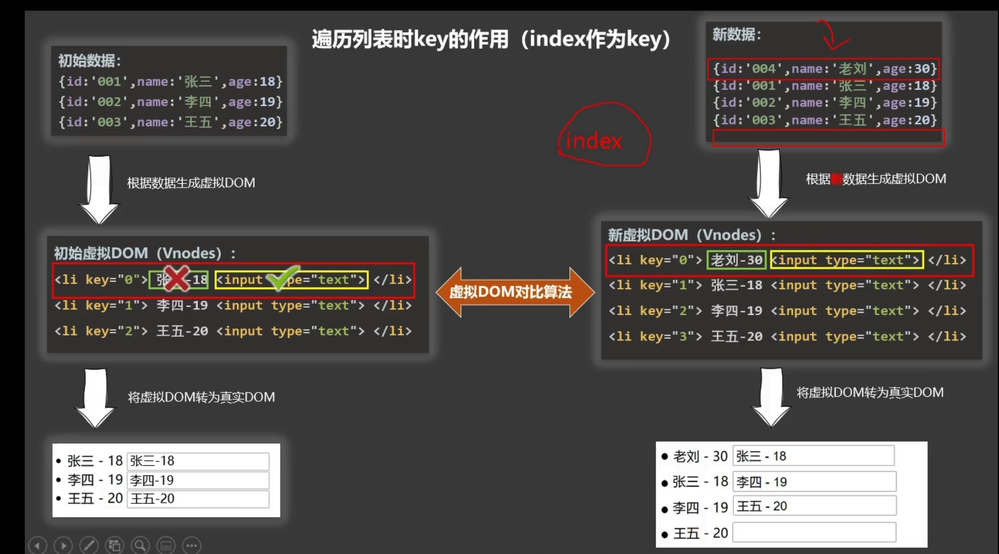
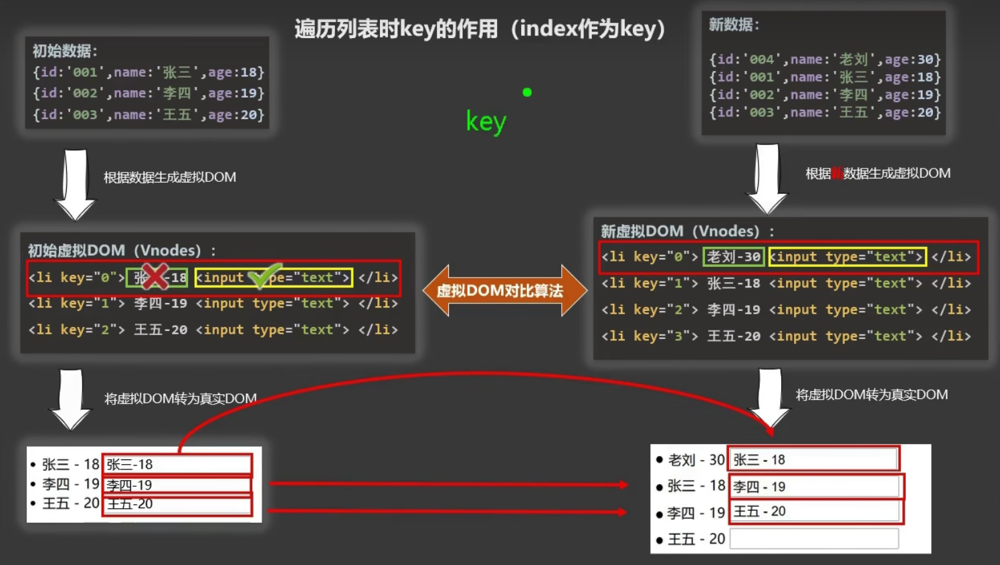

## 列表渲染

### 基本列表

-   v-for指令
    -   用于展示列表数据
    -   语法：v-for="(item, key) in xxx" :key="yyy"
    -   可遍历：数组、对象、字符串（用的很少）、指定次数（用的很少）

```html
<div id="root">
    <!-- 遍历数组 -->
    <h2>人员列表（遍历数组）</h2>
    <ul>
        <li v-for="(p,index) of persons" :key="index">
            {{p.name}}-{{p.age}}
        </li>
    </ul>

    <!-- 遍历对象 -->
    <h2>汽车信息（遍历对象）</h2>
    <ul>
        <li v-for="(value,k) of car" :key="k">
            {{k}}-{{value}}
        </li>
    </ul>

    <!-- 遍历字符串 -->
    <h2>测试遍历字符串（用得少）</h2>
    <ul>
        <li v-for="(char,index) of str" :key="index">
            {{char}}-{{index}}
        </li>
    </ul>

    <!-- 遍历指定次数 -->
    <h2>测试遍历指定次数（用得少）</h2>
    <ul>
        <li v-for="(number,index) of 5" :key="index">
            {{index}}-{{number}}
        </li>
    </ul>
</div>
```

### key的原理

-   虚拟dom中key的作用：
    -   key是虚拟dom中对象的标识，当数据发生变化时，Vue会根据【新数据】生成新的虚拟dom，然后vue进行老虚拟dom和新虚拟dom的比较，比较规则如下：
-   对比规则：
    -   旧虚拟dom中找到了和新虚拟dom相同的key：
        -   若虚拟dom中内容没变，直接使用之前生成过的真实dom
        -   若虚拟dom中内容变了，则生成新的真实dom
    -   旧虚拟dom中没有找到相同的key
        -   直接创建新的真实dom，然后渲染到页面
-   用index作为key可能会导致什么问题？
    -   如果会对数据进行逆序添加、逆序删除等破坏顺序的操作，
        -   那么会产生没有必要的真实dom更新，界面效果没有问题，但是效率比较低
        -   如果结构中含有输入框，那么界面也会有问题
-   开发中如何选择key值
    -   最好使用每条记录的唯一标识作为key，比如id、身份证号等唯一标识
    -   如果不存在对数据的逆序添加、逆序删除等破坏顺序的操作，仅仅用于渲染页面，则使用index作为key是没有问题的

```html
<div id="root">
    <!-- 遍历数组 -->
    <h2>人员列表（遍历数组）</h2>
    <button @click.once="add">添加一个老刘</button>
    <ul>
        <li v-for="(p,index) of persons" :key="index"> <!-- 修改这里的key值 -->
            {{p.name}}-{{p.age}}
            <input type="text">
        </li>
    </ul>
</div>
<script type="text/javascript">
    Vue.config.productionTip = false

    new Vue({
        el:'#root',
        data:{
            persons:[
                {id:'001',name:'张三',age:18},
                {id:'002',name:'李四',age:19},
                {id:'003',name:'王五',age:20}
            ]
        },
        methods: {
            add(){
                const p = {id:'004',name:'老刘',age:40}
                this.persons.unshift(p)
            }
        },
    })
</script>
```

key为index



key为唯一标识



-   不写key的时候，vue默认key是index

### 列表过滤


